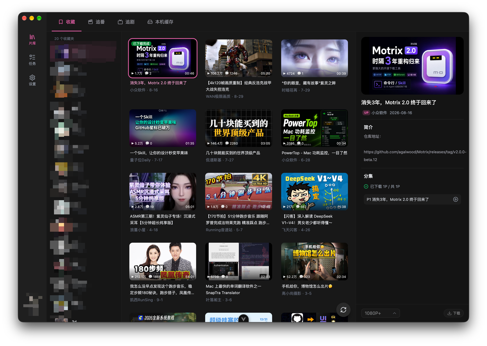

<div align="center">
  
  <h1>BiliMux</h1>
  <p><b>B 站视频下载与缓存转换</b></p>

  <p>
    <a href="https://github.com/W-David/bilimux/releases">
      
    </a>
    <a href="https://github.com/W-David/bilimux/blob/main/LICENSE">
      
    </a>
  </p>
</div>

---

## 这是什么

BiliMux 是跨平台桌面应用，支持 Windows、macOS、Linux：

- **转换缓存**：扫描 B 站客户端已下载的缓存（音视频分离的 m4s），一键合成 MP4
- **下载片单**：登录后下载自己的收藏、追番、追剧，自动合成 MP4

## 预览

**片库 · 收藏**



**片库 · 追番**


**片库 · 本机缓存**


## 安装

到 [Releases](https://github.com/W-David/bilimux/releases) 下载对应安装包：

| 平台                   | 安装包                |
| ---------------------- | --------------------- |
| Windows（x64）         | NSIS 安装包（`.exe`） |
| macOS（Apple Silicon） | DMG（`.dmg`）         |
| Linux                  | AppImage 与 deb       |

macOS 未签名，首次打开可能提示「已损坏」。拖入「应用程序」后执行：

```bash
sudo xattr -rd com.apple.quarantine /Applications/BiliMux.app
```

Windows / Linux 可在应用内检查更新。macOS 发现新版本时会打开 GitHub 下载页，需手动安装。

## 开发

需要 Node.js >= 22 与 pnpm >= 11。

```bash
pnpm install
pnpm dev          # 热更新，渲染进程 :8880
pnpm build:mac    # 或 build:win / build:linux
```

开发模式的配置和数据写在独立的 `bilimux-dev` 目录，不会和正式版混用。

## About

**rushwang** · [@W-David](https://github.com/W-David) · <cooody@163.com>

## License

本项目基于 [MIT License](LICENSE) 开源。内置 MP4Box 来自 [GPAC](https://gpac.io/)，遵循 LGPL v2.1 或更新版本，详见 [THIRD_PARTY_NOTICES.md](THIRD_PARTY_NOTICES.md)。

## Notice

本项目与哔哩哔哩无关，仅供个人学习使用。请遵守 B 站用户协议，勿用于传播或商业用途。
